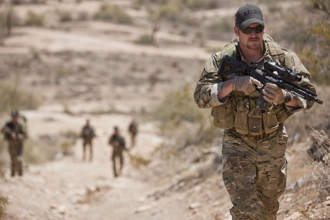

In the scariest places in the world, and during the scariest times in a soldier’s life, saving lives often means taking lives. For American sniper Chris Kyle, this defined ten years of his life as he served our country as the most lethal sniper in United States history. Kyle once told a magazine that he wished that he could calculate the number of people he had saved. He stated that he wasn’t a hero, and that he was just a regular guy. However, I couldn’t imagine this hero being more wrong.

Christopher “Chris” Kyle is recognized as the most lethal sniper in United States history, with over 160 confirmed kills in his ten years of service to our country. After Kyle “hung up his hat” as a professional bronco rider, he enlisted in the Navy as a Seal in 1999. As the oldest enlistee in the program, he endured the rigorous training of the Seals motivated by the desire to serve his country. During ten years in the military, Kyle served four tours in Iraq. All the while he had a wife and two children waiting for his safe return home. In 2009, Kyle received an honorable discharge and wrote an autobiography, _American Sniper_, which was made into a movie in 2015.

The movie _American Sniper_ tells the story of Kyle's struggles as he faces the realities of war, the brutality of taking lives, and the deaths of his brothers-in-arms. It shows us his path from fighting for his life and the lives of his “brothers” every day to the life of a civilian. Kyle saved the lives of many American soldiers during his service, and by doing this he had to do some extreme things that we, in our “safe little lives,” wouldn't imagine doing.

Kyle’s first confirmed kill was an Iraqi woman and her son. Kyle describes seeing the woman with a grenade. In order to do his job and protect the marines that were on the ground, he had no choice but to pull the trigger, taking the woman's life. The little boy then picked up the grenade and started walking towards the marines. Again, he was forced to pull the trigger. Kyle's actions that day not only saved the lives of the marines, but he saved all of ours, even though we had no idea it was happening. Kyle would still dare say that he wasn't a hero.

I’m sorry, Kyle, but you are wrong. The Oxford dictionary defines a hero as “a person who is admired or idolized for courage.” Kyle’s willingness to pull the trigger, knowing the questions and criticisms that would follow, takes unbelievable courage. His courage saved fellow marines. His courage saved American lives. Kyle literally went through hell and back in order to protect his “brothers” and his country. Kyle was an amazing warrior and did so many courageous things in his service that he earned the title of hero, whether he likes it or not.

It’s because of him that people like me are inspired to be better, and I want to work hard every day in hopes people will look up to me as I look up to him.
