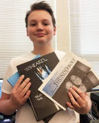

The East High journalism and yearbook staffs attended this year’s Wyoming State Journalism Conference in Casper, WY, in early October. This annual conference is hosted by the Wyoming High School Student Press Association to recognize and award outstanding high school newspapers and yearbooks in the state of Wyoming. This year was another success for the competitors from East.

This year East’s online newspaper ‘The Thunderbolt’ won All-state and the school’s print version of their newspaper, of the same name, won a bronze medal. East High alumni Courtney Walston was, once again, named the All-state Photographer. Courtney wrapped the 2015 award as well. East High sophomore Camden Schmidt earned a first place finish in News Column writing and a second place finish in Features. Walston won the gold medal in Features writing.

\[caption id="attachment\_3532" align="alignleft" width="200"\] Staff  
Camden Schmidt shows off the 2016 and 2015 East High yearbooks and an edition of the 2016 Thunderbolt. both publications were recognized at the WHSSPA convention as being tops in the state.\[/caption\]

The East High ‘Thunderbolt’ staff is going to work hard again this year in the hopes of bringing back another state championship next year. Of course, changes are a part of all print and on-line media, so the staff is looking to update things in 2016-2017.

“I would love to see our Newspaper become more modernized and less stuck in old forms of media,” said sophomore and ‘Thunderbolt’ online editor Camden Schmidt.
