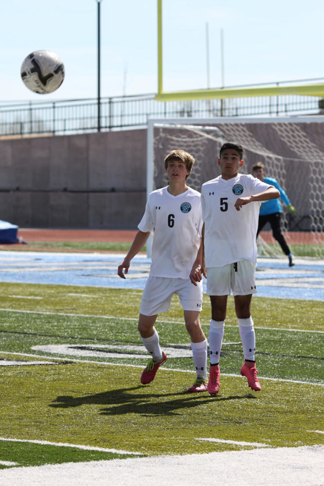

\[caption id="attachment\_4051" align="aligncenter" width="667"\]Staff There’s nothing better than that winning feeling running through your blood. Feeling 500 lbs lifted from your shoulders and relief rushing over you-crying with your friends, jumping up and down, and shouting at the top of your lungs.

Every season it comes down to the state title championship, and the Thunderbird soccer team was ready for a run. Every soccer player anticipates this game all season long, waiting to see if they will make it or not, and East high boys’ soccer team entered the last round of the state title championship facing Central.

“We didn’t really change anything (for this game,)” said sophomore Jefferson Danso. “We just listened to our coach and talked with each other out on the field.”

Quinn Hunt scored East’s first goal when he punched a direct kick into the back of the net in the 9th minute. He shot the ball 50 yards out and it bounced through the hands of the Central goalkeeper and slammed in. Fernando Lechuga added another point to the T-birds score by with a header off of the frame in the 14th minute central then countered with a goal of its own, putting them up 2-0.

Quinn Hunt then posted another score from almost 30 yards out. As the first half ended, East headed to the locker room up 3-1

“Those early goals helped so much,” Hunt said in an interview with Wyosports.net. “We were really happy to be up at halftime, but we really wanted to go out in the second half and keep control of the match.”

Although East was up 3-1 by halftime, the game became more difficult as Central scored three times to take the lead 4-3. But then freshman Carter Rich snuck in a shot while he was dead center of the goal in the 78th minute to tie things up.

“We were motivated to tie it up because worked too hard to fail.” said Danso.

The score by Rich pushed the game into overtime. As the boys worked to keep the ball out of their zone, Danso made a free kick and won the game. The Thunderbirds rushed the field in celebration. “We just kept fighting (in overtime) because we wanted to beat them,” explained Danso. “It did take a while to sink in. I couldn’t believe it went in.”
