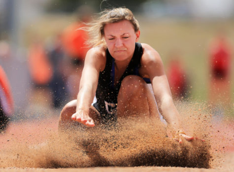

\[caption id="attachment\_4049" align="alignnone" width="475"\] Blaine McCartney/Wyoming Tribune Eagle  
Cheyenne East's Marina Howard lands in the sand in the girls long jump event during the Okie Blanchard Invitational Friday afternoon at East High School in Cheyenne. Blaine McCartney/Wyoming Tribune Eagle\[/caption\]

Teachers and coaches love to tell their students and athletes that hard work always pays off. But sometimes things don’t work out that way. Sometimes, little things can cause big problems and an athlete or student can find themselves falling short. And, then, there are times when everything works out perfectly and all that hard work is awarded with a championship.

This weekend at the Wyoming State Track Meet, Seniors Marina Howard and Cosette Stellern both came from the Wyoming State Track Meet as champions. Howard won first in high jump for the first time in her high school career, while Stellern was the back- to- back champion in discus.

Marina Howard beat out Erika Wilson from Green River and Kelly Walsh’s Louise Vilhelmson with a height of 5-4. Howard successfully cleared the jump on her third attempt.

“I think we worked harder than we ever had before,” said Howard, as she talked about her senior year of track. “We’re all a big happy family, and it was just super fun to be around each other.”

Cosette Stellern defended her state discus title with a throw of 135-6 after placing second in shot put the day before. Stellern won the title alongside her sister Sierra Stellern, who had a throw of 129-8.
