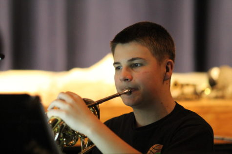
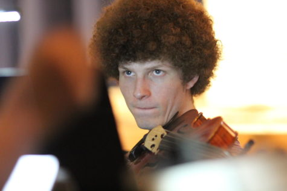

The colorful costumes, bright sets, and funny accents are more than enough to remind you of the time and energy required by the cast and crew to perform a musical. But to make it a musical, you must have one important element -the music, of course.

It’s the music that sets it apart from all else. The music sets the tone of the show, accompanies the performers through song and dance. The music hints to emotion and guides the audience. Music, of course, makes it a musical.

Once every other year, when the drama department decides on a musical, the EHS orchestra and band join together to form a pit orchestra to accompany the play. This year, the drama department selected Mary Poppins: The Musical.

Select band and orchestra students saw this as an opportunity to feature and refine their skills.

“I wanted to learn new music that was a challenge,” explained junior Tyler Link, trombone. “Sight reading music like that was very difficult, and it helped my skill set quite a bit.”

Along with 3-hour daily practices, the pit had to put in extra time on weekends and at home to make sure the show was sounding perfect by opening night.

“We were told by professionals that the music was very, very challenging,” said Mrs. Backman, pit director. “They recommended that high school students not even attempt it.”

However, the orchestra did not stray away from the challenge and were willing to step up to assist the singers to the best of their abilities.

After performing the show four times within a three day period, the pit was tired and worn out. They also walked away with a huge sense of accomplishment and satisfaction for performing such a hard show.

“The pit experience involves a lot of commitment and time,” explained Mrs. Backman “It really is a good experience for our students to participate in the real life, playing for a musical experience. It’s a good idea to use a live pit whenever we can.”

Not only did the pit perform a fantastic show, but they walked away with new skills and new friends.

“We all had to endure grueling rehearsals together for months,” said senior Connor Brown. “The pit definitely ended up being like a family.”

So next time you go to musical, listen up. There are tons of talented musicians performing their very best to put on a show for you. After all, it wouldn’t be a musical without music.[Steph Sommer](https://ehsthunderbolt.com/4172/uncategorized/steph-sommer/) [Steph Sommer](https://ehsthunderbolt.com/4172/uncategorized/steph-sommer/)
