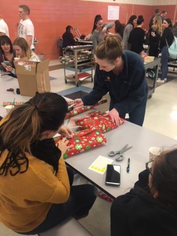
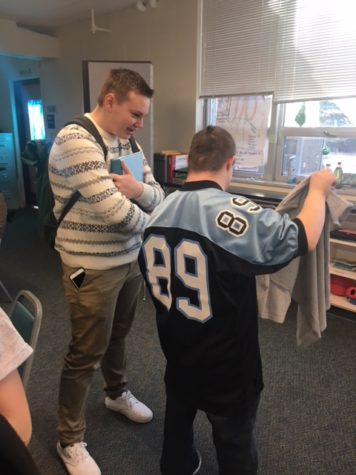

 

What is the most important thing about the holiday season? Food? Presents? Family? How about giving back to those in need? East High students and teachers take giving back to heart during the holiday season. From wrapping gifts for underprivileged families to playing concerts for veterans, the Thunderbirds are truly wrapped up in the holiday spirit.

**Thanking Teachers for Their Time** Every year the EHS student council hosts a Thanksgiving Dinner for East’s faculty to come together for the season. Student council takes this time to celebrate the faculty’s hard work and the success of Thunderbird Nation. “The staff Thanksgiving was a good way for teachers to celebrate, have a good time, and to sit, relax and enjoy each other’s company,” said Mrs. Kassel, student council advisor. For each year’s meal, the East student council brings all the fixings, including turkey, side dishes and dessert. Mr. Simineo, EHS math teacher, said that the student council did an especially nice job with the staff Thanksgiving this year, and “the yams were fantastic.” East senior Gabby Dodgson explains that it is important to give the teachers recognition. The staff Thanksgiving was a good way to celebrate the holidays and offer students a chance to give back to the teachers. Gabby Dodgson volunteers for East Cares, the staff dinner and National Honor Society. “Volunteering is a great opportunity for everyone,” said Gabby. “And the holidays make for an especially good time to volunteer.” Not only is the holiday season a good time to give to others, but it is also a wonderful time for friends and family. “It was good to sit down with colleagues,” said Mr. Simineo. “Not for work, but to just talk.”

**IB Students Donate Their Time Back to Local Schools** Students participating in the IB program at East are constantly giving back to the community, but more so than ever during the holidays. Many students get involved at literacy nights, crafting events, and STEM project nights at their triad schools. Most recently, the IB students participated in the Children’s Society Carnival at Anderson Elementary and Literacy Night at Henderson Elementary, giving them the opportunity to play games and build Christmas-themed crafts with elementary students. “I think it’s important to get involved with younger kids so they have an opportunity to get out of the house,” said IB junior Emily Purifoy. “They’re not just sitting at home and watching TV. They get out of the house and get to make crafts and see their classmates.”

**DECA Members Get Creative with PALS Students** Throughout the month of December, a few DECA members have been regularly visiting the PALS room at East. DECA had the students design school spirit shirts, and they are now having the shirts made just for them. “This time of year is all about coming together and being one unified school,” said senior DECA member EC Wells. “We think it’s important to get every piece of East involved and in the holiday spirit, and working with the PALS kids helps include a vital part of our school in the holiday traditions.” The PALS kids will each receive their personally designed shirt as a gift from the EHS DECA chapter at the end of the month, when the members put on a Christmas party for the PALS students.

**Strolling Strings Serenades Those Who Served** Strolling Strings is a performance group based out of East that is reserved for students willing to dedicate time outside of school to play for a variety of events and charities. “I enjoy Strolling Strings because you get to play for important people,” said Leanna Ashworth, a freshman violin player. Over 30 years ago, Mr. Mathews started Strolling Strings with the intent to provide music for community functions. “I wanted a small group that could play non-traditional string music,” he said. The group has gained popularity in the Cheyenne community, offering great music for any type of event. December is the busiest time of the year for Strolling Strings with many events in need of holiday music. Strolling Strings plays for retirement homes, varying organizations, such as the Salvation Army, and the Cheyenne Frontiers Day rodeo and parade. Most recently, Strolling Strings played Christmas music for the veterans at the Veterans Affairs (VA) hospital. “It was wonderful, and the veterans really love to see kids come in and talk with them,” said Gene, a caretaker at the VA. “It shows them that what they did matters to people still.” In Mathews’ view, playing for the veterans is the highlight of his year. “It’s the most important one we do, because we see the physical sacrifice for our freedom,” said Mathews. “We need to come more often to show our appreciation.”

**Teachers and Students Unite to Help Those Less Fortunate in TBird Nation** Every holiday season the EHS faculty and staff come together and form a charitable group called East Cares. The group actually exists year-round, ready to help less fortunate students, but it makes the most difference during the holidays. The group, organized and directed mainly by the office staff, compiles a list of names in the East community that may need a little extra help during the Christmas season. “We heard from teachers and counselors that we had kids that were in need,” said Mrs. Lucas, office manager. “There are kids in this school who sit right next to you in class, and you won’t even realize that they’re in need.” The main office staff sends out the list to staff, who sign up to help buy presents and necessary items for the families. Often, the teachers ask students to get involved with donations. Once all donations are turned into the main office, a variety of EHS clubs meet to wrap the presents. This year, the wrapping clubs included National Honor Society, FFA, and more. The teachers and students enjoy the time spent with their friends, and the feeling of giving back to the community. “There’s a lot of clubs who get involved, and they either wrap or go out and buy their list of presents themselves,” said Mrs. Lucas. This year, 40 families were adopted by East Cares, and they received gifts of essential items and toys to make their Christmas merry.

