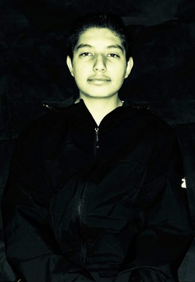

The great debate: are ghosts real? Or just a figment of one's imagination? 

Do you hear weird sounds at night? Is something sending shivers down your spine? Do you have unexplained noises plaguing your mind? Ghosts have been the topic of debate for many years as TV shows, movies, and popular entertainment seek to put ghosts in a fun, exciting, and almost terrifying light. There is no scientific explanation as to why we hear the sounds, the creaks, and the slamming of doors, so the question that must be asked is **_Are Ghosts real? Or are they an unexplained mystery?_**   

To fully grasp the concept of ghosts: we must what we are fully dealing with. Ghosts are defined by the English dictionary as an apparition of a dead person which is believed to appear or manifest in the living word, typically as a nebulous image.

Some people have complex opinions on the topic of ghosts and their frequent activity. The Cheyenne East Students shared their opinions on the existence of ghosts.

\[caption id="attachment\_7390" align="alignleft" width="175"\] Junior Caleb Miller. ([Emma Mayfield](https://ehsthunderbolt.com/staff_profile/emma-mayfield/))\[/caption\]

“I do \[believe in ghosts\]," says Savannah Schilling, 12, who has witnessed strange and interesting activity throughout her early years. “We lived in the super old house in Colorado up till my 2nd-grade year and when nobody was home, there would be creaking and cracking in the house like someone was walking around and windows would slam shut.”

Schilling believes that she could probably not see a ghost but could potentially have contact with them as they roam throughout this world.  However, there is some skepticism when talking about the grim grinning beings as Caleb Miller, 11, explains.

“I've never seen a ghost," says Miller. "So I can't say for sure that they’re real, but I’ve felt all the creakings… different things you can’t explain.”

Miller also expressed the idea that he believes in the possibility of seeing a ghost, but he still isn’t sure.

“Other researchers claim that the reason ghosts haven’t been proven to exist is that we simply don’t have the right technology to find or detect the spirit world," stated Live Science in an article entitled “Are Ghosts Real?”

There is also the stark opinion of not being able to see the spirits or even feel them at all as Ruben Salazar, 10, explains.

"I don’t believe in ghosts because I've never seen them," Salazar explains. “I’m the type of person that has to see it to believe it.”

\[caption id="attachment\_7391" align="alignright" width="158"\] Sophomore Ruben Salazar. (Emma Mayfield)\[/caption\]

To answer the burning question, the human world still does not have a clear answer as to how or what causes paranormal activity. Science believes it is a trick of the mind, but some of the human population believes that there is still something mysterious behind the creakings and unexplained noises.

What do you believe?

\[sno-poll id="7376" result\_color="#000000" tile\_color="#ffffff" align="left" background="on" background\_color="" border="all" border\_color="#888888" border\_size="1px" shadow="on"\]
