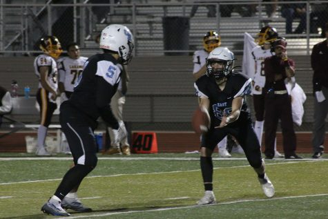
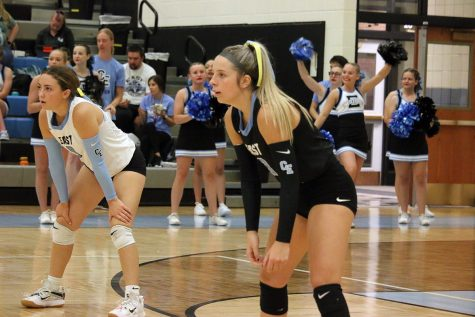
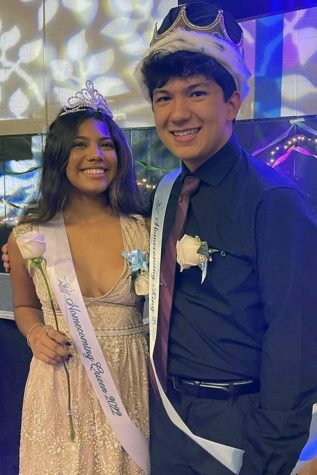

The website vocabulary.com defines unity as, “being together or at one with someone or something. It’s the opposite of being divided. This is a word for togetherness or oneness. When a bunch of people at as one and are on the same page, they’re displaying unity. When people are bickering and disorganized, there’s no unity. In any group or cause, unity can be hard to find and maintain.”

Each year the East High School administrative team seeks a strong start to the new school year. The beginning of clubs, transition of new freshmen, new sports seasons, academic groups, and the incoming seniors all work together to maximize the closeness the student body has boasted in years past.

This is especially true for the 2022-2023 school year. This year, the EHS administrative team announced the school-wide theme of “CommUNITY” in hoped of creating an environment of togetherness- oneness.

“We want our student body, like we always have, to act like a community within East High School, and to make sure that we treat each other like a small community,” East High School principal Sam Mirich said. “Looking out for each other, taking care of one another, and also doing what we’re supposed to be doing in this community to be successful.”

What better way is there to rally the student body community together early in the year than homecoming?

Homecoming spirit week started strong with window painting after school on Monday, September 12, followed by the Tuesday movie night, Wednesday volleyball games, a co-ed volleyball tournament on Thursday, and finally the homecoming pep rally preceding the Friday night football game. A highlight of the pep rally was the unmasking of the T-Bird mascot that fired up the students in the stands.

“I thought it was really fun and a great way to bring everyone together and do something as a school,” sophomore Hagen Regnier recalled about the week’s activities. “It kind of got us all ready for the game too. It was funny when they took the \[T-Bird mascot\] mask off and it was Mr. Mirich, because everyone was like ‘I bet it’s Mr. Mirich’ and we were all screaming because we were right.”

The competitive energy started with a dominating win by the T-Bird volleyball team. The Lady T-Birds took care of business against South High, 3-0, posting 25-7, 25-12, and 25-7 wins. Senior Jaylyn Christensen led the Thunderbirds with six of the team’s seventeen aces.

The Thunderbird football team then put Laramie in its sights for a Friday night showdown.

The football team was all about quick strikes. In the first quarter, East posted three touchdowns, including an 84-yard kickoff return by senior Garet Schlabs, setting up a 7-yard touchdown reception by senior Don Kaszas.

East took a 21-7 lead into the second quarter and never looked back, beating the Plainsmen, 63-7.

School spirit peaked at the homecoming dance on Saturday night. Senior Patrick Coggin was crowned Homecoming king, and senior Elysia Diaz was named Homecoming queen.

Freshman Logan Hamilton was impressed by the cheering crowds and how the excitement was contagious throughout the entire week leading up to the homecoming dance.

“I really liked hanging out with the team and doing the homecoming parade and everything, especially winning the game,” said Hamilton. “Like I’m on the freshman team so it was a great memory just joking around and really getting into football.”

The Homecoming theme was ‘Fairytale Ending’, something that excited some students into going all out, surprising junior Allie Wagner.

“There was just so much energy and school spirit going around,” admitted Wagner, “I wasn’t expecting the costumes, but they were so cool to see at homecoming. Someone even had a Cinderella costume on, and everyone was wearing crowns.”

The East High School community has fully revved up for an exciting school year. Thunderbird Nation will build on the momentum going through the entire school year. It’s a year of unity – CommUNITY!
