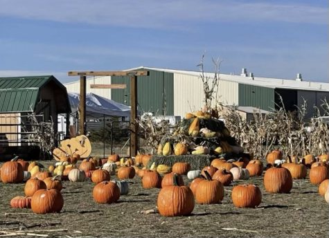

 

\[caption id="attachment\_7383" align="alignnone" width="475"\] Pumpkins decorate the Cheyenne pumpkin patch. (Bailey Earley)\[/caption\]

As fall ushers into full swing, the East High School clubs and staff are excitedly preparing for new activities to engage the Cheyenne community! Starting last year, a new tradition has started that has enticed the student body: the pumpkin patch.

East High nurse Kelsey Baumgartner was elated to talk about the pumpkin patch, which was a project that she and FFA teacher Joe Allen put together in order to raise money for both clubs.  

“I am really excited about the fall pumpkin patch because there isn’t any kind of fall festival that is around Cheyenne, no pumpkins,” says Baumgartner. “While we are bringing all of our pumpkins into Cheyenne, it is a really good opportunity for all those families with little kids to come out and have a lot of fun for a pretty inexpensive price.” 

Fall on the Farm was a huge success! SkillsUSA and FFA worked extremely hard in order to raise money for their state and national competitions. FFA president Caitlyn Heatherington, 12, has some exciting things to say about the pumpkin patch.  

“We did it last year actually and it wasn’t hosted by Skills or FFA,” commented Heatherington. “It was pretty successful, but this year seeing as it’s a fundraiser for the school it has been a lot more successful and our advisors have been crunching a lot of numbers and we will actually make quite a bit of money both Skills and FFA which is really good, and we are thinking about moving away from doing other fundraisers and just sticking with Fall on the Farm.” 

East High School’s SkillsUSA and FFA clubs are excited to finish their big pumpkin path with a bang. They encourage all East students to come out and enjoy the last weekend of festivities. 

 

Saturday 10/22: 11:00 a.m.-4:30 p.m. 

Sunday 10/23: 9:00 a.m.-2:30 p.m.
