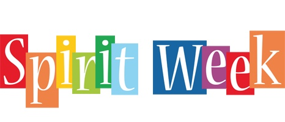

This week is spirit week

 

at East High school. The student body dressed up as Barbie vs. Ken for homecoming spirit week to show school spirit today. Here are some students expressing how they feel about today’s spirit day.

 

“I really like the Barbie vs. Ken spirit day, but I wish there was more ken’s out there instead of just Barbie’s,” says Murphie Dahill, 1l. Ken’s are very underrated, even though they are just as important as Barbie’s. Dahill wishes people went more out, instead of just dressing in pink. “I didn’t really dress up because I didn’t have any pink shirts,” says Dahill, 11. Having a pink shirt is superior especially on Wednesday.

“I think that the spirit day is really fun compared to our other verses days,” says Natalyia K

 

opack, 10. The Barbie vs. Ken spirit day is quite different from any other verses days we have done in the past. Kopack thinks that this spirit day is exciting because the movie just came out. “I dressed up because pink is my favorite color and I really love the Barbie movie,” Kopack, 10. The Barbie movie has been very popular ever since it came out.

“I think today’s spirit day is really cute and I loved how everyone dressed up, there was a lot of people that dressed up,” says Autumn White, 11. White is very happy that the student body participated in today’s spirit day. “I dressed up mostly because I had a lot of pink stuff but also, I think it’s a really cute spirit day,” says White, 11. Since the barbie movie came out wearing pink has been quite the fashion trend.

