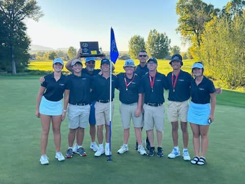

The Cheyenne East High golf team dominated the competition to win their first state championship since 1986. The team was led by outstanding performer Daniel Meyer who won the individual state championship in Wyoming 4A. The team had a remarkable season after winning the Douglas Invite, Conference, and the state title.

Two years ago, Daniel Meyer 11, placed dead last in the state tournament, and this year he made a huge leap to win the individual state championship. Daniel attributed his success to a simple formula, “A lot of practicing in the winter, playing every day, and always taking it seriously.” said Daniel. The hard work and dedication of Daniel is the key reason he managed to have that turn around and take home the championship.

Daniel kept working as much has, he could for the last few years to be able to be the best he “I was definitely trying to get stronger in the gym and get my ball speed up,” Daniel said. “Getting my ball speed up helped me hit the ball further which gave me an advantage off the tee, and being able to hit clubs that I'm more confident with was important.” The physical aspect of golf is undervalued but contributes a lot to all around success in the sport.

The team knocked it out at state in Sheridan. Junior Nash Coleman posted 80-76, for a 156 total. Junior Daniel Meyer shot a 77-74, for a 151 total. Senior Tayten Zitek shot a 82-76 for a total score of 158. Senior Kael Lissman posted a score of 90-82, for a 172 final. Senior James Trask shot an 80-80, for a final score of 160. And on the girls’ side, Junior Jaimee Palmer posted a 107-91, for a total score of 198. Freshman Cooper Rauzi posted a 94-96, for a final score of 190.
