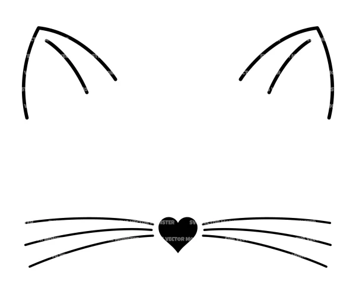

The world is changing rapidly. It is changing throughout all age groups, in and out of workforce, homes, and most importantly, schools. One of the more unique changes we see in society is the acceptance or denial of “identifying” as an animal. The ability or need to identify as a gender or animal has become a topic that can generate plenty of disagreement.

 

Co-founder of Furscience, Courtney Plante, told Reuters, “furries are fans, just like any other fan group,” adding, “furries are no more likely to think that they’re animals than sports fans are to think that they’re their favorite team’s quarterback”.

 

Many people confuse their theories with furries.

 

“The rains believe deep down inside that they are trapped in a human body but were meant to be some other species” said Dr Kathy Gerbasi, a psychologist in studying both, in the same Reuters article.

 

Psychology professor Elizabeth Fein, who also researches furries and therians, told Reuters: “while therians recognize that have human bodies, they also might feel they have the reincarnated soul of a wolf, or what they have a sense of affinity with cats that is so deep that that are on some level of cat themselves. Foe some of these folks, its enjoyable to do things those animal as would do – bark, or growl, or rough- house play in an animalistic way. Many feel a pervasive sense of discomfort with their own human bodies”.

 

There is a large number of people in our country who disagree with this lifestyle and believe it is a distraction, particularly in our schools. According to Pew Research, the world is split about 50/50 on if you should be able to identify as an animal or as something other than you were born as. The 30 and older age group predominately believe that your identification is determined at birth and that should not change.

 

“It is very annoying to see so many people being able to do and act however they want, not having a care in the world how they are acting toward and around people” said Danika Fenton, 11. Being able to act like an animal on school property is not right and it can very disturbing”.

 

While not overly common in our local schools, identifying as an animal is becoming more prevalent. According to Pew research ages 18-29 believe that your identification can be different than assigned at birth. People that have a high school diploma or less also say the same thing.

 

One of the more difficult considerations of this issue is the liberty to choose.

 

“I feel like they should be able to do what they want because it is a free country even though it is a little bit weird” said Dayana Wood, 11. It doesn’t really bother me what they choose to do and how they choose to act”.

 

This is going to make a statement in our society weather it is going to help or hurt our society. People are going to have to accept that the world is changing rapidly whether it is for the good or bad.
