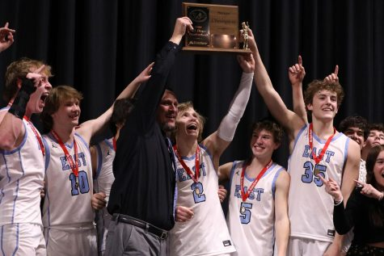

\[caption id="attachment\_7593" align="alignright" width="475"\] Colter McAnelly, Brenden Bohlmann, Coach Rusty Horsley, Garet Schlabs, and Kysar Jolley celebrate East High’s first boys basketball state title since 2006. ([Autumn McPherson](https://ehsthunderbolt.com/staff_profile/autumn-mcpherson/))\[/caption\]

On March 11th, 2023 at the Ford Wyoming Center in Casper, another piece of East history was created. East battled against Laramie high school and for the first time since 2006, the boys basketball won the championship at state.

From being number one in the Southeast region their entire regular season, it was no surprise that they would make it to state, but with amazing teams like Thunder Basin and Cody taking down the girls, it was hard to say how the final game would play out. As the team already knew, in order to succeed a team needs a game plan and good communication to accelerate in the ranks.

“To prepare for state we watched a lot of films, practiced hard, scrimmaged against each other and just trying our best to make one another better," said Drew Jackson, 11. "Because our team was super close this year I think that helped our communication and how we played a lot. It was super exciting to win state with all my teammates and friends. My goal for next year is to obviously win another state championship, but to also have a close team like we did this year."

The boys' hard work paid off as they came home with a first place championship to show off their success. In the end, the boys basketball team had a fantastic season this year that upcoming players will have a hard beating.
