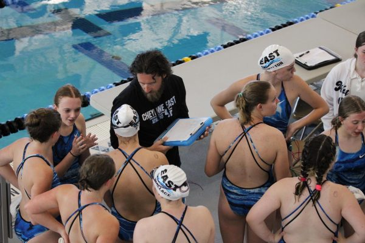

 

\[caption id="attachment\_7707" align="alignnone" width="453"\] east v.s. central swim meet (Autumn Rayl)\[/caption\]

Beep! The buzzer blares! Will you win or lose, kick or quit? Swimming is more than just a sport, it’s a family, a culture, a team. Surviving a swim season often takes more than just power and talent. It’s also a bonus when your team stands poolside and cheers you onto victory. That team becomes family.

One really important thing about the swim team is family. "The team means a lot to me,” said coach Robert Brown. “I enjoy getting to work with these young ladies every day. I take time away from my day job to come work with these girls. I also get a lot of say when I see progress and improvement. To me it's very rewarding.".                                                                                                            The one great thing about the swim team is no matter how bad you are or how great you are the coaches are still there for you and work with you because they want you to get better even if you are great.

Even though the hours in the pool are long, swimmers must stay motivated. "I try to motivate the swimmers by connecting to them personally, and understanding what drives them,” said head coach Jon Anderson “(I want to) get to know what they want to achieve in swimming.”

Along with family comes hard work and motivation and even sometimes tears. "As a coach I try to motivate swimmers by giving them a lot of encouragement by telling them how hard they have been working or how fast they are,” said Brown. “I try to also be upbeat and excited for practices and meets that way my emotions trickle down to them.”

Motivation is what drives a team to state and motivation can make all the difference at the end of a long season. Motivation and hard work are the most important things, according to the coaches, so they push the swimmers to get them where they know they can be.

Inevitably family and motivation create a culture with the team. Some teammates think the culture can make things harder. “Some aspects of it are” said Mary Grace Quintana 11. “There is an ‘I’m better than you’ aspect of the team”. but often swimmers think the culture of the team is important. “The culture of the team is a very positive setting, “said Sydni Sawyer,12. “Everyone is encouraging and supporting on another.”

Not every team is perfect, and it’s okay for a family to have rough days, but in the end, it’s all about the team and the pursuit of victory.
