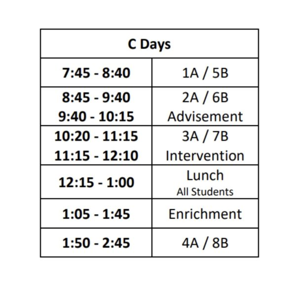

Students and teachers are struggling to get ahead of this new Friday schedule. Every student has the same lunch and must sign up for an enrichment class. They also have an intervention time where students are given time to do homework or go to other classes they may need help in.

 

“I think people were getting told different things on how the schedule works, and that’s why it was such a hot mess.” Said, Lexie Bryson, 11.

 

But, how does this affect the kids who have off hours? Students vary their opinion off their own schedule, yet students are just mad that there was a change.

 

“Why do we have to change our enrichment class every week?” Said, Ariana Volanos, 10.

 

On the first day of enrichment, there were a lot of kids in the gym who were not registered for enrichment class. Will we ever get the hang of intervention, enrichment, and having the same lunch? The schedule has so far created chaos.

 

“I think people were getting told different things on how the schedule works, and that’s why it was such a hot mess.” Said Bryson, 11. 
