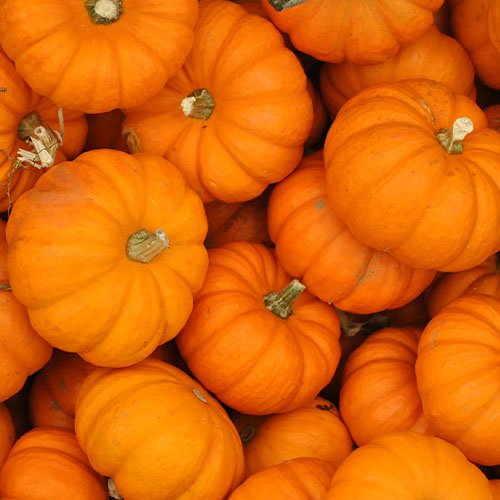

 

Alexander Spatari- countryliving.com

Some people's favorite Halloween traditions are decorating with their families and carving pumpkins.  Others like watching scary movies and having the feeling of their heart dropping to the bottom of their stomach and the hair on their arms going up.

39% of the population in the U.S. likes visiting pumpkin patches and 37% like going trick or treating, and 36% of people like exploring haunted houses.

Many people have a different idea of what the best part of Halloween is.

"The aesthetic around the holiday and everything that leads up to it. Like carving pumpkins, red, yellow, green, and brown leaves on the ground, pumpkin patches, corn mazes, scary movies and many more," said Avalynn Nordmark, 10.

Her favorite scary movie is the first Scream movie. “It’s a classic when people think of Halloween, and it just screams Halloween to me and the first one in my opinion has a better effect than the other ones do, and I don’t think that the other ones are bad they are just not as special or stand out as much.”  said Nordmark. Nordmark every year on Halloween goes over to a friend’s house, watches scary movies and eats candy.

“My favorite fall Starbucks drink is the pumpkin chai,” Nordmark. The handcrafted beverage has Starbuck's signature Espresso and steamed milk with the celebrated flavor combination of real pumpkin, cinnamon, nutmeg, and clove which makes it well known during the fall time.
