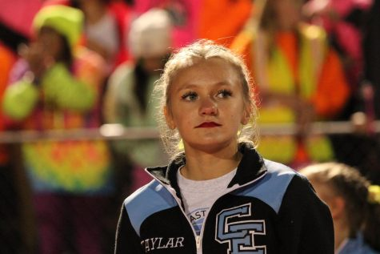
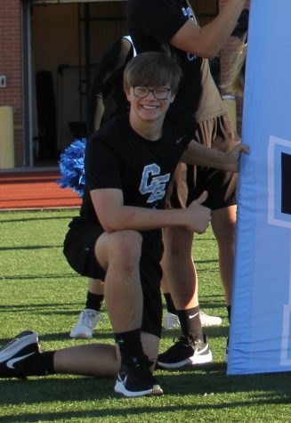
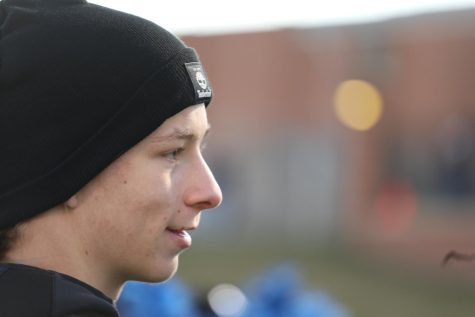
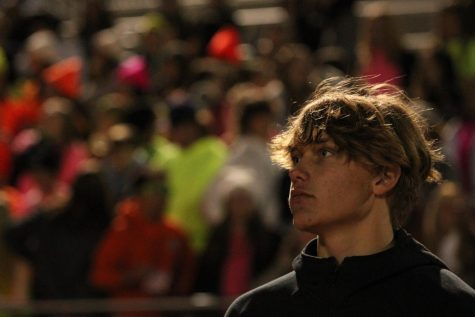
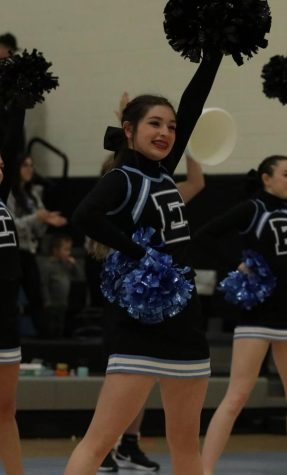

With the 2023 Wyoming state cheer and dance competition being this month, the newbies of the Cheyenne East High Cheer team express their excitement.

“My favorite thing about the routine has to be the stunts and my personal favorite stunt is toss to hands," said Taylor Scott, 9. "The advice I would  give to incoming cheerleaders would be just to stay humble and focus on yourself and not worry about anyone else. I’ve never been to state so I don’t really know what to expect but I have heard it’s really stressful your first time and a lot of fun."

\[caption id="attachment\_7547" align="alignleft" width="198"\] Taylor Scott, 9. ([Kendra Upton](https://ehsthunderbolt.com/staff_profile/kendra-upton/))\[/caption\]

Sophomore Seth Trezise joined cheer this past year in inspiration of his oldest brother also being a former cheerleader.

\[caption id="attachment\_7554" align="alignright" width="185"\] Seth Trezise, 10. ([Kalie Hiller](https://ehsthunderbolt.com/staff_profile/kalie-hiller/))\[/caption\]

“My favorite part about our state routine is the rainbow to hands, which is a partner stunt from the ground," commented Trezise. "It’s like toss hands but with an assist. One thing that I would tell incoming cheerleaders is its important to spend off time from school and cheer to stretch and workout. Cheer takes a lot of memorization skills and stamina, especially for the guys. Just put in extra time and simply enjoy it. I am most excited for state to be over. Not that I don’t like state, but that it is extremely stressful and it’s a whole lot more fun without the stress."

Along with Seth, his older brother Hunter Trezise, 12, joined cheer as a senior. He has never competed at state cheer but has competed at state football.

\[caption id="attachment\_7549" align="alignleft" width="273"\] Hunter Trezise, 12. ([Autumn McPherson](https://ehsthunderbolt.com/staff_profile/autumn-mcpherson/))\[/caption\]

“My favorite part of the state routine would be the stunts except for the shoulder stands during the cheer," shared Hunter. "It kills my shoulders and because we’re cheering, we are moving around causing even more pressure on our backs, tiring us out for the rest of the routine. For anyone who may be thinking about joining cheer, I would tell them working out is essential for cheer because we are lifting a person, that’s what has helped me improve the most. When it comes to state."

Junior Ryker Hager, former student and cheerleader from Cheyenne South High, joined cheer his sophomore year and moved to East this past year.

\[caption id="attachment\_7546" align="alignright" width="312"\] Ryker Hager, 11. ([Kendra Upton](https://ehsthunderbolt.com/staff_profile/kendra-upton/))\[/caption\]

“My favorite part of the co-ed routine would be my partner stunt and the pyramid," said Hager. "The advice I would give to new cheerleaders would be don’t give up easily because it will get very hard at times but if you just keep going it’s a lot of fun. I’m most excited to just go to state again because just being there is so much fun and seeing other people you know from other schools and getting to talk to them is a lot of fun. The environment all together with all of the cheerleaders is a lot of fun."

Freshman Marica Quick joined cheer as a seventh grader and continued cheering in high school.

\[caption id="attachment\_7548" align="alignleft" width="155"\] Marica Quick, 9. ([Autumn McPherson](https://ehsthunderbolt.com/staff_profile/autumn-mcpherson/))\[/caption\]

“I think my favorite part of the state routine is when we do our switch ups, which is a group stunt where the flyer starts on the left foot then on the way up to an extension switch to the right foot into a lib, because that is the only stunt I’m actually in and I love stunting," shared Quick. "Being involved in as many things as you can before the actual season starts is extremely important because it shows coaches how dedicated and a hard worker you are, and participating in summer weights will help you build your muscles, like for me, I was really weak and I have improved a lot in cheer just by working out. I am extremely nervous for state because it is my first year, so I have never competed, and I just don’t know what to expect."

The cheerleading experience is full of trials and difficulties in order for each member to put their best foot forward into making the team the best it can be. Good luck to the East cheer team as they move into the second semester and prepare for state cheerleading!
