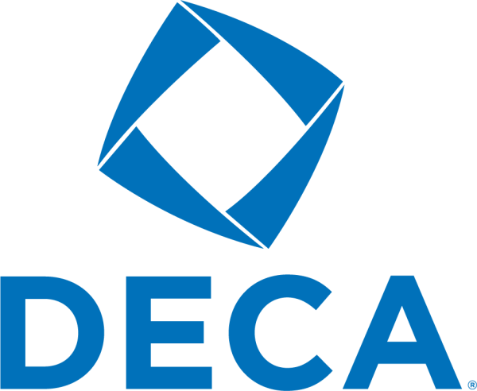

This October, Cheyenne East’s DECA chapter attended the first conference of the year. MEC, or the Marketing Entrepreneurship Conference.  Members of DECA visited the University of Wyoming all day, attending workshops and tours. Most importantly, they competed for the first time. The chapter brought back ten top performers. Four of them earned two awards, one in their speaking event, and another based off their DECA test scores. This conference is the only one to happen before State. That means attending competitors get just one opportunity to truly practice before the national qualifying tournament. 

“MEC really gives us a jumpstart on the competition. It gets us in the DECA mindset and ready for DECA time.” said Ella Golwitzer, 10. “It really helped me connect with the people and when you connect with the people, you can really do well and focus.” Last year, Golwitzer ranked top 20 in her events at DECA internationals. This year, MEC was the starting conference to her sophomore year season.  

“It helped me because this is what DECA was about, like the things we did at MEC gave me a taste of what I'm going to see at State and hopefully nationals. It was just such a good kickstart” -Jacob Schwartz, 11. Schwartz, and the rest of the chapter competed in their first “roleplays” of the season at MEC. In this type of event, you sit down with a judge and roleplay an interview situation. Schwartz was one of the four Cheyenne East students to win two top performer awards.  

Sometimes preparing for these events can be extremely challenging. “Flores gives us a lot of time to prepare at practice, he gave us resources. We had practice interviews leading up to MEC. I talked to my teammates as well, and people I know from other high schools that are also involved in DECA.” -Jacob Schwartz, 11. “I personally created pamphlets to give to the person that was interviewing me.” Preparation is key to doing well in DECA, and the East High chapter quickly realized that their practices had paid off on the MEC final stage.  

MEC was a learning experience for the Cheyenne East DECA chapter. Now the team’s job is to prepare for national qualifier in February. For any student hoping to go to DECA internationals, (ICDC), MEC is the first step in understanding their events and succeeding. To excel at their next conference, East High DECA students must keep up the same amount of hard work. Only thewill they be able to hope that their state conference is as successful as this one. 

