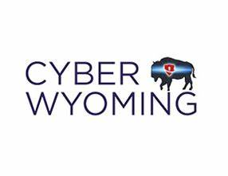

We are excited to announce that the Cheyenne East Computer Science Department is officially registering to compete in the Cyber-in-a-Box School Video Challenge for the 2024-2025 school year! This is a fantastic opportunity for our students to apply their skills in cybersecurity, creativity, and teamwork while exploring a crucial topic: _Exploring the Energy Industry and its Connected Devices_.

How We’re Participating:

To kick things off, our team will be forming a group of up to 5 students from our department, along with Mr. Harrison to lead the project. Our goal is to create a video that is both educational and engaging, geared toward helping audiences of all ages understand cybersecurity in the context of the energy industry.

Funding and Resources:

We’re currently fundraising to support our team’s participation, and funds will be distributed on a first-come, first-serve basis. As part of the challenge, our team will receive $50-$100 to help with video production costs, along with free t-shirts to wear during the event and the premiere.

Premiere and Awards:

- Virtual Statewide Premiere: The virtual premiere will take place on April 17th at 2 p.m. During the event, we’ll have the chance to see our hard work showcased alongside other teams from across the state. Awards will be given for categories such as:
    - Funniest Video
    - Most Creative
    - Most Informative
    - Best Translation of the Topic
- Local Premieres: Local premieres will be hosted through the Wyoming State Library, where we’ll be able to gather and celebrate our video, discuss the project, and learn from other teams. We’re encouraged to attend and share our experiences in creating the video.

As the Cheyenne East Computer Science team, we’re excited about the chance to explore how cybersecurity plays a role in today’s energy systems, apply our technical skills, and collaborate in a fun, creative way. This challenge is a great opportunity for our students to not only deepen their understanding of cybersecurity but also contribute something valuable to our community.

We can’t wait to see what we come up with, and we’re ready to make some waves in this year’s Cyber-in-a-Box School Video Challenge. Stay tuned for updates and be sure to check out our video during the premiere!

