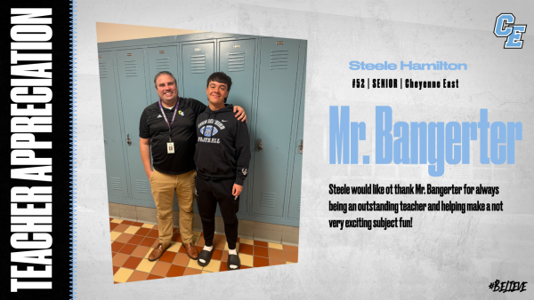

Our Cheyenne East High School Football Team is excited to take a moment to recognize and celebrate some of the incredible teachers who have had a positive impact on the lives of our student-athletes. Each year, our senior football players come together to share their gratitude for the educators who have helped shape their high school experience, both on and off the field. This tradition is one of the highlights of our season, and we are proud to honor those who dedicate themselves to inspiring and empowering our students.

The relationship between a teacher and a student is often one of the most important parts of a student's journey. For many of our senior football players, their teachers have provided more than just lessons in the classroom, they’ve given them guidance, encouragement, and support that extend beyond academics. These teachers have helped foster a sense of self-belief, discipline, and perseverance, traits that are just as important on the field as they are in the classroom.

As a way to show our appreciation, each senior player will be sharing a special message about one teacher who has made a lasting impact on their lives. It could be a teacher who has gone above and beyond to offer help and guidance, someone who has inspired them to pursue their passions, or simply someone who has been there when they needed support the most. Our football players are grateful for the role these educators have played in shaping who they are today.

Over the next few days, we’ll be highlighting each of these special teachers and the students who have chosen to recognize them. We’ll be sharing slides on our social media featuring the football players alongside their favorite teachers, with messages of thanks and appreciation. We hope these posts will shine a light on the incredible work our educators do every day to help students succeed not just in their studies, but in all aspects of their lives.

 

      
