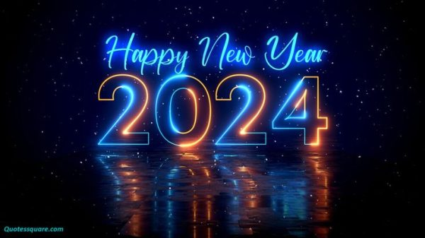

Fireworks, countdown, and celebrations took place Sunday night across the  globe, as people bid farewell to the year 2023 and welcomed 2024. In the Unites States, we all know the traditions: The ball drop at Times Square, sharing a kiss with a loved one at the stroke of midnight, and countless amounts of fireworks. 

New Year’s Eve is celebrated all around the world, even East High School celebrated the New Year. Here are some students expressing how they feel about New Year’s Eve. The celebration of New Year’s Eve is deeply ingrained in many cultures and is often associated with the anticipation of new beginnings.  

“I like New Year’s Eve, I think honestly it’s kind of just an excuse to have a party and go out with friends,” says Natalyia Kopack, 10. It sounds like New Year’s Eve might be a little overrated. Kopack doesn't see much of a point in the holiday but still enjoys participating. “I went to my best friend Rosie’s house, and we made pancakes, watched movies, and played board games,” says Natalyia Kopack, 10. A great way to celebrate is spending time with friends. 

“I think New Year’s is a really great reminder that it’s okay to be able to reset your mind and body for the new year, and set new goals for yourself,” says Shai Prime, 10. Mindset and goals are very important. Prime thinks that New Year’s Eve is a very good experience for everyone. “What I did for New Year’s Eve was it was a Sunday this year, so I did an ultimate reset day, like skincare and selfcare,” says Shai Prime, 10. Skincare is also very important to start off the new year on the right foot.
