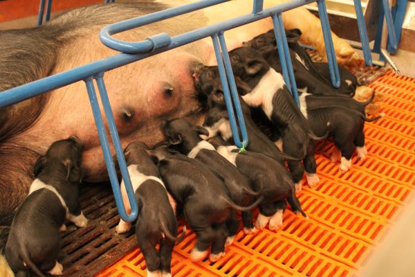

FFA members worked together to help two pigs prepare to give birth this year. Students would come in early in the morning to feed the pigs and clean the pin. These students love the experience, “It’s a great part of our organization”, said Bradly Mucirty, 11.

Yet, once it comes around the time the pigs were ready to give birth it became a little stressful. This is because FFA members had to keep watch of the pigs on a YouTube live stream and paid attention because they did not know the exact time the pigs would be giving birth. “We ended up just spending the night”, said Colton Shick,11. These students ended up staying till around midnight.

However, this experience really brought the students together. They all made a big job easy by working as a team and enjoying this memorable moment. “We drank soda to keep us awake and watched shows why we waited”, Said Abby Allen, 11.
