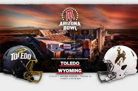

On December 30th Toledo falls to Wyoming 16-15 in the Arizona Bowl. Wyoming scored 10 points like it was nothing in the fourth quarter.  The rockets took at 10-6 lead during halftime, but it wouldn’t the Arizona Bowl without drama and tension down the field.

Junior kicker John Hoyland was named Wyoming’s MVP after three field goals, a 52-yarder and scoring the game winning touchdown from 24 yards with only four seconds left on the clock.

Wyoming sent their coach Craig Bohl out on a good note for his last Bowl. Coach Bohl now has a record of a 2-1 in Arizona bowl and now a 9-4 record. It be safe to say that Bohl will have a huge smile on his face on the way out.

 

 

It’s pretty likely that this bowl could’ve  have been the biggest bowl of them all, from making last memories, to ground breaking scores and mind blowing plays.
